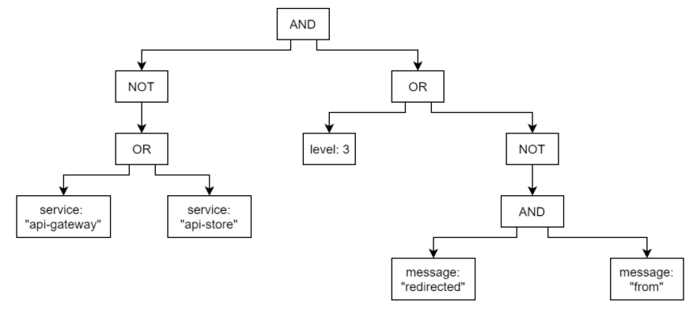
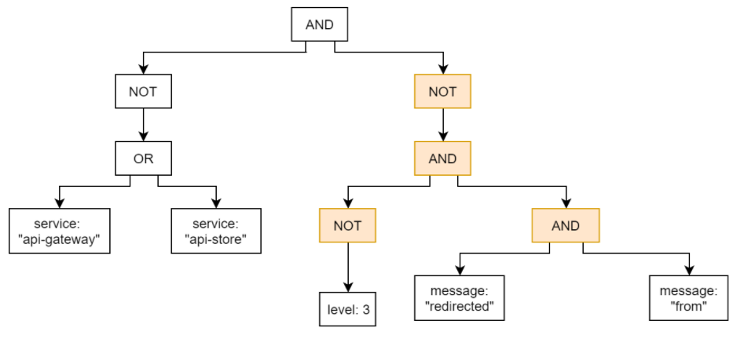
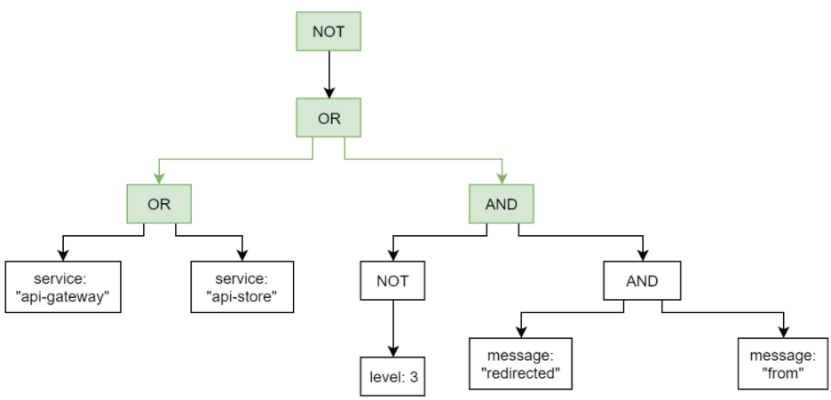

# How search request parsing works

## Query language

Our query language is similar to the Apache Lucene, but it has some differences.

* 
	In the base of the request are `field queries`: they can be `literal` type or `range` type. These queries have `field` and `request` parts. They ask for all documents, that have `field`, that satisfies `request` (string matches/range matches/wildcard matches). They also can have wildcards.
	Range boundaries can be inclusive and non-inclusive
	
	Examples:  
	
	* `service: alertagent`
	* `service:"cms-api"`
	* `message:"protobuf error"`
	* `service:"cms*api"`
	* `message:"proto* error"`
	* `level: 3`
	* `level:[3 TO 5]`
	* `level:[3 TO *]`
	* `level:{1 TO 5}`
	* `m:a`

* 
	Then you can unite the subqueries wia logical operators: `*query* AND *query*` / `*query* OR *query*` / `NOT *query*`. They are pretty straitforward. NOT has the highest priority, AND has second and OR has third.

	Examples:

	* `m:a AND m:b`
	* `NOT m:a`
	* `m:a OR m:b AND m:c AND NOT m:d OR m:e`

* 
	Also you can use brackets to change operators priority

	Examples:

	* `m:a AND (m:b OR m:c)`
	* `m:a AND NOT (m:b OR m:c) OR m:d`
	* `m:a AND NOT ((m:b OR m:c) OR m:d)`

## Parsing overview

Entrypoint is `parser/query_parser.go/ParseQuery` in `parser.go`. There are also several other variants, including ones used for testing purposes.

This is Recursive descent parser.
There's basic TokenParser, capable of parsing single Token (literal or range).
And there's QueryParser, which embeds TokenParser, that one is responsible for
parsing the query, and doing 'not propagation' step afterward.

Due to differences in parsing Term's for different types of field, there's
termBuilder interface, which implementations are essentially event-based parsers.

## NOT propogation

This is a nice, but complex optimization, so let's talk about it a little more. 

AND and OR operations are fast in a way that they work in `O(len(left)+len(right))` complexity. NOT is slow, because it works in `O(len(documents))` (in a fraction) complexity, and not in `O(len(child))`. You can also see, that `NOT *query* AND *query*` (AND with only one NOT child) operation can be evaluated efficiently.

And also there are De Morgan Laws, that helps us propagate NOT: `NOT (a AND b) == (NOT a OR NOT b)` / `NOT (a OR b) == (NOT a AND NOT b)`

These two observations give us an ability to propagate NOT to the root of the query. Algorithm is simple, you traverse the AST tree from the leaves upwards, and check some rules:

* If the node is AND
	* If it has 2 NOT childs, apply De Morgan laws to this AND (so, replace the 2 NOT nodes with just their childs, replace AND to OR and add a NOT at the root of current node)
	* If it has 1 NOT child, make this NAND (NOT AND) node, meaning this is a special node, that can evaluate this expression in a fast manner
* If the node is OR
	* If it has at least 1 NOT child, apply De Morgan laws. If this node had 2 childs, the NOT is propagated above. But if it has only 1 child, this node becomes NAND node in the end.
* Else do nothing

This algorithm gurantees, that after it there will be some NAND nodes and `<= 1` NOT node, which is good: we can reduce an arbitrary numbers of NOT nodes into not more than 1.

Here is a query with two NOT operations:

We start at the right OR and change it according to the rules:

This AND with one NOT child becomes NAND node, and we also added (propagated) NOT above, so now we go to the root AND node:

In the end, we are left with one NOT node at the top, with which we can't do anything, so it leaves there.

## Terminology

* Token - part of query responsible for one field.
  There's literal token, which consists of Field and Terms,
  and there's range token, which consists of Field and unnamed right part.
* Field - the left part of the query on fields: `*field*:terms`
* Terms - the right part of the query on fields: `field:*terms*`  
There can be additional parsing done, like parsing the wildcards, ranges, spaces, etc.
* AST - abstract syntax tree. See images above for an example. It does know the order of the operations and how operations relate to each other.